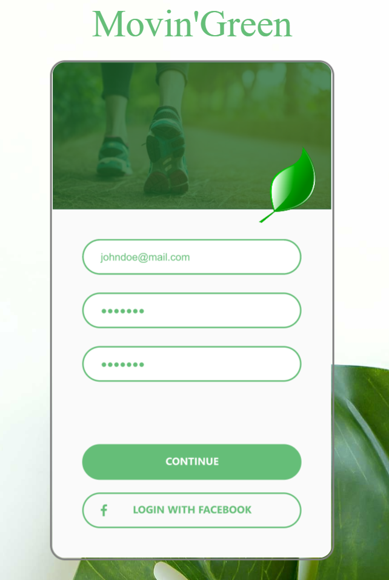

 # Projet Movin'Green

Réalisation d’une application mobile informative,
intuitive et ludique. Elle sera gratuite.
L’application proposera un suivi des trajets
effectués par l’utilisateur ainsi que des conseils
adaptés à son profil en fonction des objectifs
définis. Il aura la possibilité de voir son total de
kilomètres parcourus et ses émissions de CO2 sous
forme de graphiques (ses données seront
comparées avec d’autres utilisateurs faisant partie
de sa liste d’amis).
Dans le cadre de la lutte pour le climat, notre client, 
une ASBL souhaitant s’impliquer dans ce combat, veut développer
une plateforme afin d’informer le citoyen des impacts climatiques
causés par ses déplacements, et d’offrir des alternatives pour diminuer 
son empreinte écologique.

La maquette ci-dessous a été créée avec ADOBE XD.
Ouvrez le code pour découvrir la maquette au complet =)) 
 
